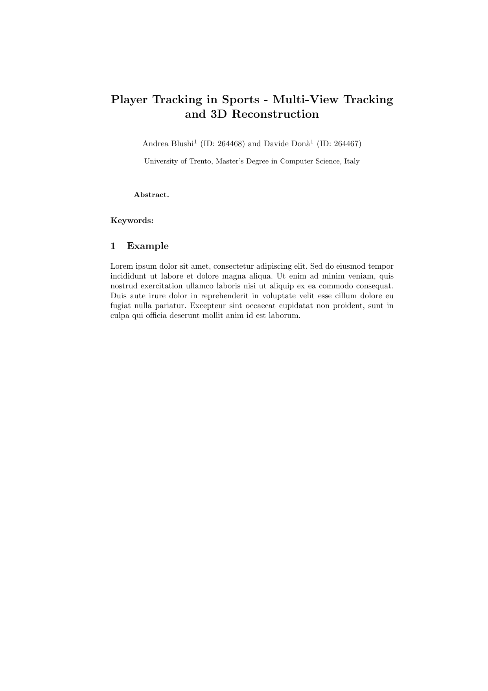

# Player Tracking in Sports - Multi-View Tracking and 3D Reconstruction

<div align="center">
    <strong>
        <a href="docs/report/report.pdf">View Full Report (PDF)</a>
    </strong><br><br>
    <a href="docs/report/report.pdf">
        
    </a>
</div>

**Course:**  Computer Vision    
**Professors:**   Prof. Nicola Conci, Prof. Giulia Martinelli   
**Authors:** Andrea Blushi, Davide Donà 

---

# Overview

## Prerequisites

## Setup Environment

## Running the Project


## Repository Structure

```
player-tracking-in-sports/
├── notebook.ipynb              # Jupyter notebook with code and explanations
├── src/                        # Source code  
├── docs/                       # Documentation and reports
└── README.md                   # This file
```

