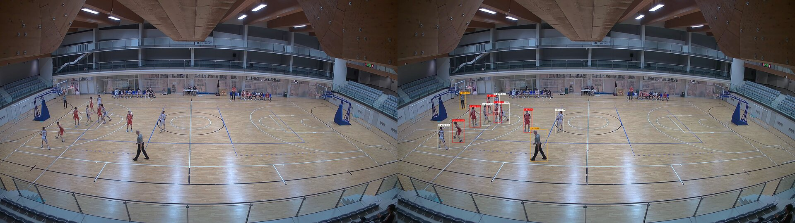
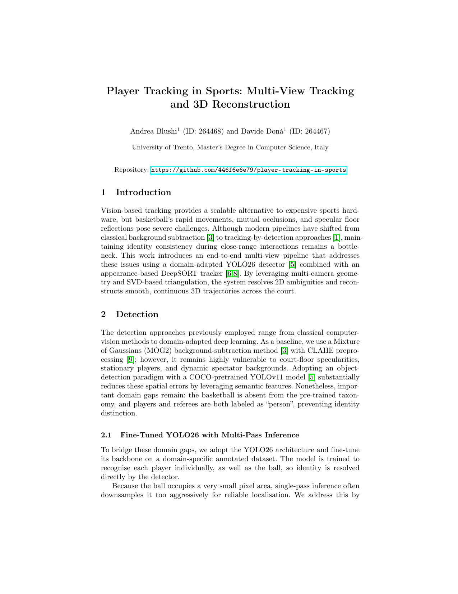

# Player Tracking in Sports - Multi-View Tracking and 3D Reconstruction

## Results

> 📓 **Full results and the end-to-end pipeline are in the [notebook](notebooks/main.ipynb).**

### 2D Tracking

*Input (left) · Tracked output (right) · Camera 13*

<div align="center">

</div>

### 3D Reconstruction

*Triangulated player positions across all three camera views*

<div align="center">

https://github.com/user-attachments/assets/d35f3c35-7488-4aa2-8599-425408802872

</div>

---

<div align="center">
    <strong>
        <a href="docs/report/report.pdf">View Full Report (PDF)</a>
        &nbsp;·&nbsp;
        <a href="docs/presentation/presentation.pdf">View Presentation (PDF)</a>
        &nbsp;·&nbsp;
        <a href="https://huggingface.co/446f6e6e79/YOLO-basketball-fineTuned">🤗 Fine-tuned model on Hugging Face</a>
    </strong><br><br>
    <a href="docs/report/report.pdf">
        
    </a>
</div>

**Course:**  Computer Vision    
**Professors:**   Prof. Nicola Conci, Prof. Giulia Martinelli   
**Authors:** Andrea Blushi, Davide Donà 

---

## Overview

End-to-end pipeline for tracking basketball players and the ball across multiple synchronised camera views and reconstructing their 3D positions on the court. 

For the detection step, a fine-tuned YOLO is run as a two-pass scheme (player pass at 1280 px, ball-only pass at 1600 px), cleaned via class-independent NMS and merged. 

Tracks are produced with DeepSORT and stabilised by a cumulative-confidence label-resolution step.

The 3D reconstruction pipeline triangulates the merged 2D detections across views using the camera extrinsics, then smooths the resulting 3D tracks with a forward Kalman filter.

## Prerequisites

- **Python 3.11+** (matches `requirements.txt`: `numpy==2.4.3`, `torch==2.11.0`).
- **ffmpeg** on `PATH` for OpenCV video writing. Can be installed via `brew install ffmpeg` on macOS or downloaded from the [official site](https://ffmpeg.org/download.html) for Windows/Linux.
- **Match videos** in `data/videos/` as `out2.mp4`, `out4.mp4`, `out13.mp4` (cameras `cam_2`, `cam_4`, `cam_13`).
- **Fine-tuned YOLO weights** at `models/fine_tuned_models/best.pt`. Auto-downloaded from the [🤗 Hugging Face repo](https://huggingface.co/446f6e6e79/YOLO-basketball-fineTuned) on first run; you can also produce your own with the fine-tune flow below.
- **OSNet appearance weights** at `models/osnet_x1_0_msmt17.pt`. Required by DeepSORT for re-ID features. Download `osnet_x1_0_msmt17.pt` from the [deep-person-reid model zoo](https://kaiyangzhou.github.io/deep-person-reid/MODEL_ZOO) and place it in `models/`.
- **Roboflow API key** (only needed if you run the evaluation cell in `notebooks/main.ipynb`). Copy `.env.example` to `.env` and fill in `ANNOTATIONS_API_KEY`.

## Setup Environment

```bash
python3 -m venv .venv
source .venv/bin/activate
pip install -r requirements.txt
```

`requirements.txt` is a full freeze of the dev environment, so this installs both runtime dependencies and the notebook tooling (Jupyter, pytest, mypy, …) in one shot.

## Running the Project

### Exploratory notebook — `notebooks/main.ipynb`

```bash
jupyter lab notebooks/main.ipynb
```

Walks through MOG2 baseline → YOLO baseline → fine-tuned two-pass detection → merge → tracking-evaluation → triangulation → evaluation.

Change `INSPECT_CAMERA_ID` in the second cell to switch between `cam_2`, `cam_4`, and `cam_13`.

### End-to-end 2D pipeline — `scripts/run_2D_pipeline.py`

```bash
python scripts/run_2D_pipeline.py --camera cam_13
```

Writes `results/<camera>/videos/tracking_resolved.mp4`. See the docstring at the top of the script for the full step list.

Useful flags:
- `--max-frames N` — stop after N frames (smoke testing).
- `--save-detection-video` / `--save-tracking-video` — also write the intermediate videos.
- `--model <path>` — override the default fine-tuned weights.
- `--yolo-batch N` — YOLO inference batch size (default: from `config.yaml`).
- `--chunk-size N` — frames per processing chunk (default: from `config.yaml`); smaller values reduce peak RAM.
- `--force` — overwrite existing output files.

### End-to-end 3D reconstruction pipeline — `scripts/run_3D_reconstruction_pipeline.py`

```bash
python scripts/run_3D_reconstruction_pipeline.py --cameras cam_13 cam_4 cam_2
```
See the docstring at the top of the script for the full step list.

Optional flags:
- `--render-minimap` — write a stand-alone top-down minimap MP4.
- `--overlay-video` — write a radar-overlay MP4 on top of camera A's source video.
- `--render-3d-graph` — write a 3D matplotlib animation MP4 of the triangulated scene.
- `--max-frames N` — limit frames rendered for `--overlay-video`.
- `--force` — overwrite existing output files.

### Run the pipelines on Colab — `notebooks/pipeline_colab.ipynb`

Thin Colab orchestrator around `scripts/run_2D_pipeline.py` and `scripts/run_3D_reconstruction_pipeline.py`, designed for a Colab GPU runtime so YOLO inference can use larger batches than a laptop allows. Place the synchronised match videos under `/content/drive/MyDrive/cv-project/videos/` (or upload them directly from a notebook cell); the fine-tuned weights are auto-downloaded from Hugging Face on first run.

### Fine-tune YOLO

Two options.

**Colab (recommended — needs GPU).** Open [`notebooks/finetune.ipynb`](notebooks/finetune.ipynb) in Colab, set the runtime to GPU, add `ROBOFLOW_API_KEY` to Colab Secrets, and fill the `TODO_WORKSPACE` / `TODO_PROJECT` / `TODO_VERSION` placeholders. The final cell downloads `best.pt` to your machine — drop it into `models/fine_tuned_models/` to use it from `notebooks/main.ipynb` or the pipeline script, or push it to the [🤗 Hugging Face repo](https://huggingface.co/446f6e6e79/YOLO-basketball-fineTuned) so other contributors can auto-download it on first run.

**Local.** Download a Roboflow YOLO export manually, then:

```bash
python scripts/finetune.py --data <export>/data.yaml --device 0
```

Defaults: `imgsz=1280`, `batch=4`, 300 epochs, `patience=30`. Copy the best checkpoint to `models/fine_tuned_models/best.pt` (or pass `--out` to the script).

## Repository Structure

```
player-tracking-in-sports/
├── config.yaml                   # All tunable pipeline defaults (loaded via src/config)
├── src/                          # Library code
│   ├── calibration/              # Camera params and extrinsics
│   ├── cli/                      # Shared argparse helpers for pipeline scripts
│   ├── config/                   # Pydantic schema + YAML loader for config.yaml
│   ├── detection/                # MOG2, YOLO, NMS
│   ├── tracking/                 # DeepSORT, label resolution, trajectory smoothing
│   ├── geometry/                 # Rectification, triangulation, Kalman smoothing
│   ├── evaluation/               # Metrics against Roboflow annotations
│   ├── paths/                    # Camera/reconstruction path resolution and preflight
│   ├── visualization/            # Rendering helpers
│   ├── types/                    # DetectionOutput / TrackingOutput dataclasses
│   └── utils/                    # Video I/O, visualization, annotations
├── scripts/
│   ├── run_2D_pipeline.py        # End-to-end 2D pipeline (CLI)
│   ├── run_3D_reconstruction_pipeline.py  # End-to-end 3D pipeline (CLI)
│   ├── calibrate_extrinsics.py   # Calibration helper
│   └── finetune.py               # YOLO fine-tuning (CLI)
├── notebooks/
│   ├── main.ipynb                # Exploratory walkthrough
│   ├── finetune.ipynb            # Colab orchestrator for scripts/finetune.py
│   └── pipeline_colab.ipynb      # Colab orchestrator for the 2D + 3D pipelines
├── data/                         # Videos, calibration, annotations (git-ignored)
│   ├── camera_data/              # Per-camera intrinsics and extrinsics JSON
│   └── videos/                   # Source match videos (out2.mp4, out4.mp4, out13.mp4)
├── models/                       # YOLO and OSNet weights (git-ignored)
│   └── fine_tuned_models/        # Fine-tuned checkpoints (best.pt)
├── results/                      # Generated detection/tracking/3D outputs (git-ignored)
├── docs/                         # Report and presentation
│   ├── report/                   # Report LaTeX sources + report.pdf
│   ├── presentation/             # Beamer slides + build_pptx.py + presentation.pdf
│   └── assets/                   # Shared figures, references.bib, logo
├── requirements.txt
└── README.md
```
